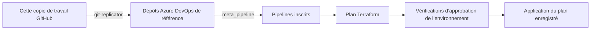

# Maintenance du déploiement de référence

[English](./MAINTENANCE.md) | [Présentation de l’architecture](./README.fr_ca.md) | [Dépannage](./TROUBLESHOOTING.fr_ca.md)

Ce guide concerne la maintenance de ce monodépôt GitHub et du déploiement de référence qu’il publie. Il couvre les opérations nécessaires pour rassembler un système Azure DevOps distribué dans une seule copie de travail. En adoption normale, les équipes travaillent directement dans leurs propres projets et dépôts Azure DevOps.

## Publication de la référence

Le processus ci-dessous sert à mettre à jour le déploiement de référence depuis cette copie de travail GitHub. Dans un déploiement opérationnel, les équipes soumettent leurs modifications directement dans les dépôts Azure DevOps appropriés.



Pour ce déploiement de référence, effectuez les modifications dans la copie de travail principale. Le [réplicateur Git](./git-replicator/README.md) publie les fichiers de la copie de travail dans les dépôts de destination, avec un commit par dépôt modifié. Les fichiers non suivis permis par les règles d’exclusion Git sont inclus. Les fichiers de destination absents des sources sélectionnées sont supprimés; conservez donc les modifications du déploiement de référence ici plutôt que dans les clones générés ou les dépôts répliqués.

Le [méta-pipeline][meta] découvre les fichiers `.tfvars.pipeline_registration` et crée les définitions de pipelines ainsi que leurs autorisations d’accès aux ressources. Le [modèle Terraform partagé][template] initialise, valide et planifie chaque module racine Terraform. Lorsqu’il détecte des modifications, il publie le plan enregistré et applique ce même plan dans l’environnement configuré. Un plan sans modification saute l’étape d’application. Les exigences d’approbation proviennent des vérifications de l’environnement.

## Intégrer MyFirstWorkload par les pipelines

Les modules d’intégration résident dans MyCoreProject/Infrastructure et utilisent la connexion d’amorçage. Ils suivent les structures existantes du projet, d’Entra et des connexions de service. La connexion est regroupée sous `AzureDevOps/Projects/MyFirstWorkload/service_connections/workload/`, avec des modules Terraform distincts pour la licence, les autorisations du projet, Azure RBAC et la fédération.

| Module racine | Responsabilité | Modules préalables |
| --- | --- | --- |
| [project](<./AzureDevOps/Projects/MyCoreProject/Repos/Infrastructure/AzureDevOps/Projects/MyFirstWorkload/project/>) | Projet Azure DevOps et membres humains. | Amorçage Core existant. |
| [MyFirstWorkload-SP](<./AzureDevOps/Projects/MyCoreProject/Repos/Infrastructure/Entra/AppRegistrations/MyFirstWorkload-SP/>) | Inscription d’application Entra, propriétaires et principal de service. | Amorçage Core existant. |
| [devops_license](<./AzureDevOps/Projects/MyCoreProject/Repos/Infrastructure/AzureDevOps/Projects/MyFirstWorkload/service_connections/workload/devops_license/>) | Intégration du principal de service à Azure DevOps. | Identité Entra. |
| [devops_project_permissions](<./AzureDevOps/Projects/MyCoreProject/Repos/Infrastructure/AzureDevOps/Projects/MyFirstWorkload/service_connections/workload/devops_project_permissions/>) | Appartenance du principal à Project Administrators et Endpoint Administrators. | Projet et licence Azure DevOps. |
| [service_connection](<./AzureDevOps/Projects/MyCoreProject/Repos/Infrastructure/AzureDevOps/Projects/MyFirstWorkload/service_connections/workload/service_connection/>) | Connexion de service fédérée et identifiant fédéré de l’application. | Projet et identité Entra. |
| [azure_rbac](<./AzureDevOps/Projects/MyCoreProject/Repos/Infrastructure/AzureDevOps/Projects/MyFirstWorkload/service_connections/workload/azure_rbac/>) | Contributor sur le groupe de ressources. | Identité Entra et groupe de ressources. |
| [resource_group](<./AzureDevOps/Projects/MyCoreProject/Repos/Infrastructure/AzureResourceManager/Subscriptions/AAFC VSE Benefit/Resource Groups/Teamy-Workload-MyFirstWorkload-DEV-RG/core/resource_group/>) | Teamy-Workload-MyFirstWorkload-DEV-RG. | Amorçage Core existant. |
| [state_file_storage_account](<./AzureDevOps/Projects/MyCoreProject/Repos/Infrastructure/AzureResourceManager/Subscriptions/AAFC VSE Benefit/Resource Groups/Teamy-Workload-MyFirstWorkload-DEV-RG/core/state_file_storage_account/>) | Compte dédié, règles réseau héritées, conteneur privé statefiles et rôles de données des identités d’amorçage et de charge de travail. | Groupe de ressources et identité Entra de la charge de travail; identité, compte et règles réseau d’amorçage existants. |
| [resource_provider_registrations](<./AzureDevOps/Projects/MyCoreProject/Repos/Infrastructure/AzureResourceManager/Subscriptions/AAFC VSE Benefit/resource_provider_registrations/>) | Inscription de Microsoft.AppConfiguration au niveau de l’abonnement. | Amorçage Core existant. |

L’[environnement d’approbation](./AzureDevOps/Projects/MyFirstWorkload/Repos/Infrastructure/AzureDevOps/Projects/MyFirstWorkload/environments/Main/), le [méta-pipeline](./AzureDevOps/Projects/MyFirstWorkload/Repos/Infrastructure/AzureDevOps/Projects/MyFirstWorkload/meta_pipeline/) et le module [workload/app_configuration](<./AzureDevOps/Projects/MyFirstWorkload/Repos/Infrastructure/AzureResourceManager/Subscriptions/AAFC VSE Benefit/Resource Groups/Teamy-Workload-MyFirstWorkload-DEV-RG/workload/app_configuration/>) résident dans MyFirstWorkload/Infrastructure. Ils utilisent MyFirstWorkload-ServiceConnection et des clés d’état distinctes dans le conteneur de la charge de travail. La charge de travail gère sa liste d’approbateurs et son inventaire de pipelines.

Cette intégration suppose que le méta-pipeline Core et les agents auto-hébergés fonctionnent déjà, y compris leur accès à l’état d’amorçage. La publication se fait en deux étapes puisque le projet de la charge de travail n’existe pas initialement :

1. Examinez les modifications, puis publiez avec les commandes ci-dessous. Le réplicateur met à jour MyCoreProject et reporte automatiquement la publication de MyFirstWorkload jusqu’à la création du projet, qu’il signale dans `deferred_projects`. Aucune ressource de la charge de travail n’est créée localement.
2. Laissez le méta-pipeline Core traiter les inscriptions, ou déclenchez-le. Approuvez son plan pour inscrire les neuf pipelines d’intégration.
3. Exécutez les modules dans l’ordre des prérequis ci-dessus. La création du projet, `MyFirstWorkload-SP`, le groupe de ressources et l’inscription du fournisseur peuvent s’exécuter indépendamment. Exécutez la licence après l’identité, puis les autorisations du projet après la licence et la création du projet. Exécutez Azure RBAC et le stockage d’état après la création de l’identité et du groupe de ressources. Le module de stockage copie les règles réseau d’amorçage et accorde aux deux identités de déploiement l’accès au nouveau conteneur. Créez la connexion de service après le projet et l’identité. Approuvez chaque plan et terminez tous ces modules avant de déployer la charge de travail.
4. Planifiez et publiez de nouveau. Le réplicateur découvre maintenant MyFirstWorkload et peut créer MyFirstWorkload/Infrastructure et publier ses sources.
5. Amorcez localement l’environnement depuis `AzureDevOps/Projects/MyFirstWorkload/environments/Main`, puis le méta-pipeline, selon les [instructions initiales](./AzureDevOps/Projects/MyFirstWorkload/Repos/Infrastructure/AzureDevOps/Projects/MyFirstWorkload/meta_pipeline/README.md#first-run). Celui-ci inscrit `pipeline definitions`, `MyFirstWorkload-DEV` et `Teamy-Workload-MyFirstWorkload-DEV-RG - workload - app_configuration` avec leurs autorisations.
6. Déclenchez `pipeline definitions` dans MyFirstWorkload, puis le pipeline App Configuration. Examinez et approuvez le plan enregistré dans MyFirstWorkload-DEV. Les commits suivants déclenchent le pipeline approprié.

Première publication, depuis la copie de travail principale :

```powershell
terraform -chdir=git-replicator init
terraform -chdir=git-replicator plan -out=bootstrap-publication.tfplan
terraform -chdir=git-replicator apply bootstrap-publication.tfplan
```

Deuxième publication, après la réussite des pipelines du projet, de l’identité, de la connexion de service et des fondations Azure :

```powershell
terraform -chdir=git-replicator plan -out=workload-publication.tfplan
terraform -chdir=git-replicator apply workload-publication.tfplan
```

Les commandes ci-dessus exécutent le mécanisme de publication. L’environnement et le méta-pipeline de la charge de travail nécessitent aussi les premières applications locales de l’étape 5; les exécutions Terraform suivantes passent par Azure DevOps. Toute sélection explicite doit conserver chaque projet déjà géré par l’état du réplicateur. La protection contre la suppression rejette une sélection qui retire un dépôt géré; la sélection par défaut comprend tous les projets découverts.

La charge de travail utilise `teamymyfirstworkloadsa/statefiles` dans `Teamy-Workload-MyFirstWorkload-DEV-RG`. Son principal de service possède un rôle de données blob sur ce conteneur privé, Contributor sur son groupe de ressources et l’appartenance à Project Administrators et Endpoint Administrators dans MyFirstWorkload. Le module de stockage accorde aussi au principal d’amorçage l’accès aux données du conteneur. L’opérateur qui amorce localement la charge de travail doit également avoir accès aux données de ce nouveau conteneur.

Les modules Core conservent leur état sur `terraformproddwvc87/statefiles`. Les modules de connexion de service et de stockage consomment les sorties Entra depuis cet état. Le module de stockage copie les règles réseau du compte préalable au déploiement, en excluant `ipv6Rules`, comme le stockage du pool d’agents. Gardez les règles résolues et les plans privés. Après une modification des règles préalables, réexécutez le pipeline de stockage pour actualiser la copie. Les modules d’environnement, de méta-pipeline et d’App Configuration utilisent le nouveau compte sans lire l’état de Core ni les propriétés du compte d’amorçage.

Le paramètre `auto_provision = true` du pool élastique existant fournit une file dans le nouveau projet. Si sa recherche échoue pendant l’inscription, confirmez que son provisionnement est terminé avant de réessayer. La propagation des rôles Azure peut aussi exiger une nouvelle tentative du premier déploiement de la charge de travail.

La première exécution de la charge de travail n’est pas déclenchée pendant la création de sa définition, pour laisser les autorisations se terminer. Son dépôt contient une copie du modèle Terraform et de l’installateur; examinez les mises à jour des copies des deux projets lors de la maintenance de cette référence. Le méta-pipeline de chaque projet découvre seulement les inscriptions de son propre dépôt Infrastructure. Ajoutez les futures inscriptions de pipelines de la charge de travail dans son dépôt.

## Organisation du dépôt

Les dossiers `AzureDevOps/Projects/<project>/Repos/<repository>/` représentent des dépôts qui résident dans des projets Azure DevOps distincts. Leur imbrication ici rend l’ensemble de la référence visible dans une seule copie de travail; chaque dépôt de destination possède sa propre racine et ses propres contrôles d’accès.

Ci-dessous, `Infrastructure/` désigne [`AzureDevOps/Projects/MyCoreProject/Repos/Infrastructure/`][infra].

| Emplacement | Rôle |
| --- | --- |
| `git-replicator/` | Crée les dépôts de destination et publie leurs fichiers au moyen de clones Git locaux. |
| `Infrastructure/Entra/` | Inscription d’application et principal de service d’amorçage. |
| `Infrastructure/AzureDevOps/` | Membres du projet, autorisations d’amorçage, connexions de service, environnements et définitions de pipelines. |
| `Infrastructure/AzureResourceManager/` | Ressources Azure regroupées par abonnement et groupe de ressources. |
| `Infrastructure/pipeline-templates/` | Processus partagé de planification et d’application, et script d’installation de Terraform. |
| `Infrastructure/modules/` | Modules réutilisables de [réconciliation des rôles Azure DevOps][security] et de [suivi persistant des changements][rising-edge]. |

Le groupe de ressources du pool d’agents contient deux ensembles de modules racines Terraform appliqués séparément :

- [`core/`][core] : groupe de ressources, identité managée, autorisations Azure et Azure DevOps, connexion de service et stockage d’état des charges de travail. Ses pipelines utilisent la connexion de service d’amorçage.
- [`workload/`][workload] : Key Vault, machine virtuelle source, galerie de calcul et versions d’images, VMSS et pool d’agents élastique. Ses pipelines Terraform utilisent la connexion de service de l’identité managée. Le répertoire de vérification de l’état contient un pipeline de diagnostic.

Chaque module racine possède sa propre clé d’état dans le stockage distant. Exécuter Terraform à la racine du dépôt ne déploie pas tous ces répertoires.

## Prérequis du déploiement de référence

Utilisez une copie Git complète, Git, PowerShell 7.2 ou une version ultérieure (`pwsh`), Azure CLI et Terraform 1.8 ou une version ultérieure. Consultez le fichier `terraform.tf` de chaque module racine pour connaître les exigences relatives aux fournisseurs. Le modèle de pipeline exécute les outils Bash et PowerShell sur des agents Linux.

La configuration du dépôt fait actuellement référence aux valeurs d’environnement suivantes :

| Paramètre | Valeur configurée |
| --- | --- |
| Organisation / projet Azure DevOps | `https://dev.azure.com/teamdman/` / `MyCoreProject` |
| Abonnement Azure | `AAFC VSE Benefit` |
| Stockage d’état d’amorçage | `terraformproddwvc87`, conteneur `statefiles`, dans `CACN-Terraform-PROD-RG` |
| Stockage d’état des charges de travail | `teamyhubazdoagentpool1sa`, créé par `core/state_file_storage_account` |
| Réseau virtuel existant | `TEAMY-NETWORK-VNET` dans `TEAMY-NETWORK-RG` |
| Sous-réseau existant des agents | `Teamy-Hub-AZDO-AgentPool-1-DEV-VMSS-snet` |

Lors de l’adaptation de l’exemple, vérifiez les identifiants de locataire et d’abonnement, les noms, les listes d’utilisateurs et d’approbateurs, les clés d’état, les recherches de ressources réseau et la configuration des certificats dans les fichiers Terraform, YAML, JSON et les scripts. Le stockage d’état d’amorçage, l’organisation et le réseau partagé doivent être disponibles avant l’exécution des modules qui les recherchent. L’identité qui exécute Terraform doit avoir accès à Azure et à Azure DevOps, ainsi qu’aux conteneurs d’état concernés.

Pour l’authentification locale, utilisez `az login` avec le locataire et l’abonnement voulus. Des identifiants Azure DevOps peuvent aussi être nécessaires; consultez le [guide de dépannage](./TROUBLESHOOTING.fr_ca.md#le-fournisseur-azure-devops-signale-no-valid-credentials-found). Les connexions de service des pipelines utilisent la fédération d’identité de charge de travail. Ne placez pas les identifiants d’authentification dans les fichiers sources.

Le compte d’état d’amorçage et sa politique réseau restrictive étaient déjà déployés lors du développement de cette architecture. Le réseau partagé est actuellement maintenu à l’extérieur de ce dépôt dans `teamy-azure-iac/TEAMY-NETWORK-RG`. Son emplacement local actuel chez le responsable est :

```text
C:\Users\phillipsdo\source\repos\teamy-azure-iac\TEAMY-NETWORK-RG
```

Cet emplacement indique où le prérequis existant est géré; ce n’est pas un chemin consommé par la configuration Terraform de ce dépôt.

La liste d’adresses IP autorisées est volontairement absente des sources publiques. Le stockage des charges de travail copie les listes de contrôle d’accès réseau du compte préalable au moment du déploiement. Le sous-réseau autorisé des agents peut être public; les règles IP des opérateurs demeurent configurées de façon privée sur le compte d’amorçage.

## Amorçage local et transfert aux agents

Les agents Azure DevOps hébergés par Microsoft ne peuvent pas utiliser le compte d’état d’amorçage avec les restrictions réseau actuelles de cette référence. Utilisez une machine locale déjà autorisée, avec les autorisations Azure et Azure DevOps nécessaires, jusqu’à ce que le pool auto-hébergé puisse accéder à l’état.

1. Confirmez l’existence du compte d’amorçage préalable, du conteneur, du réseau virtuel partagé et du sous-réseau des agents à l’aide des renseignements documentés ou expurgés fournis par leur responsable.
2. Depuis la machine locale autorisée, créez ou importez le [projet][project] et déployez l’[application Entra d’amorçage][entra].
3. Configurez les [autorisations et la connexion de service d’amorçage][bootstrap], puis créez les [environnements et leurs vérifications d’approbation][environments].
4. Appliquez localement les [modules racines Core][core] : groupe de ressources et identité managée, puis leurs autorisations, la connexion de service de l’identité managée et le compte d’état des charges de travail. Ce dernier copie les règles du compte préalable, ce qui permet de poursuivre le déploiement depuis la machine locale autorisée.
5. Appliquez localement les [prérequis des charges de travail][workload] : Key Vault, galerie de calcul et machine virtuelle source. Vérifiez cloud-init et la connectivité.
6. Publiez l’image de galerie, puis déployez le VMSS et le pool d’agents élastique Azure DevOps. La préparation d’image déprovisionne et généralise la machine source; examinez le [script de préparation][prepare] dans le cadre de cette application.
7. Assurez-vous que le sous-réseau des agents possède un point de terminaison de service Storage et qu’une règle de réseau virtuel l’autorise sur le compte d’amorçage. Conservez cette règle si elle existe déjà; elle peut être établie dès que le sous-réseau existe.
8. Réappliquez le module racine du stockage d’état des charges de travail pour qu’il copie les règles préalables mises à jour. Une modification des règles d’amorçage ne met pas à jour les comptes des charges de travail tant que leur configuration Terraform n’est pas exécutée.
9. Publiez les sources avec `git-replicator` et appliquez [`meta_pipeline`][meta] depuis la machine autorisée lorsque son dépôt, sa file d’agents, ses environnements et ses connexions de service existent.
10. Exécutez la [vérification de l’état][healthcheck] sur le pool auto-hébergé et vérifiez l’accès aux deux comptes d’état avant de confier les déploiements Terraform courants aux pipelines. La vérification actuelle liste le conteneur des charges de travail; l’accès au conteneur d’amorçage doit être vérifié séparément.

Chaque module racine possède son propre état et son propre plan. L’inscription des pipelines ne séquence pas ces étapes à elle seule. Conservez le chemin de déploiement local autorisé pour la maintenance de l’amorçage.

L’image source active est choisie dans [`marketplace-image.json`][image], qui utilise actuellement Canonical Ubuntu 24.04 LTS avec `plan: null`. Terraform et les scripts Marketplace lisent le même fichier.

## Travail sur le déploiement de référence

Pour la maintenance locale d’un environnement de référence déjà configuré, exécutez Terraform dans le module racine à modifier. Par exemple, à partir de la racine de cette copie de travail :

```powershell
$modulePath = './AzureDevOps/Projects/MyCoreProject/Repos/Infrastructure/AzureDevOps/Projects/MyCoreProject/project'
terraform "-chdir=$modulePath" init
terraform "-chdir=$modulePath" validate
terraform "-chdir=$modulePath" plan -out=change.tfplan
terraform "-chdir=$modulePath" show -no-color change.tfplan
terraform "-chdir=$modulePath" apply change.tfplan
```

Examinez le plan avant d’exécuter la commande d’application. Pour publier les sources, revenez à la copie de travail principale et suivez les [instructions de déploiement du réplicateur Git](./git-replicator/README.md#prerequisites-and-deployment). Les commits de réplication permettent l’exécution de l’intégration continue; une copie inchangée ne produit aucun commit. Les clones dans `git-replicator/.terraform/repos/<project>/<repository>/` sont des caches jetables.

Pour ajouter un pipeline Terraform :

1. Ajoutez `.tfvars.pipeline_registration` et `azure-pipelines.yml` à côté du fichier `terraform.tf` du module racine; utilisez un pipeline voisin comme exemple.
2. Utilisez `yaml_path = "./azure-pipelines.yml"`. Définissez `pathInRepo` et les chemins de déclenchement relativement au dépôt de destination `Infrastructure`, sans le préfixe externe `AzureDevOps/Projects/MyCoreProject/Repos/Infrastructure/`.
3. Fournissez les paramètres de connexion de service, d’environnement et de pool d’agents du modèle, avec les autorisations `endpoint`, `environment` et `queue` correspondantes dans l’inscription.
4. Publiez les fichiers et exécutez le méta-pipeline. Les modifications d’inscription correspondent à son déclencheur d’intégration continue. Définissez `enabled = false` dans une inscription pour désactiver un pipeline tout en conservant sa définition.

Le modèle partagé accepte aussi `destroyPlan` et `terraformTargets`, dont les valeurs par défaut sont `false` et `all`. Examinez le plan obtenu et l’approbation de l’environnement avant l’application.

## Intégrer les prérequis à ce dépôt

Il s’agit de travaux proposés, et non d’une intégration déjà réalisée. Le déplacement des définitions du réseau partagé et du stockage d’amorçage rendrait la référence plus autonome tout en conservant une gestion privée de la liste d’adresses IP autorisées.

L’exemple de compte expurgé fourni par le responsable identifie `terraformproddwvc87` dans `CACN-Terraform-PROD-RG`, en Canada Central, avec `StorageV2` / `Standard_LRS`, l’accès réseau public activé et une politique réseau de refus par défaut. Il identifie aussi cette entrée existante de `virtualNetworkRules`, qui peut figurer dans la documentation ou la configuration publique :

```json
{
  "id": "/subscriptions/6cb7032f-2437-4f5e-91e8-676cb67e5444/resourceGroups/TEAMY-NETWORK-RG/providers/Microsoft.Network/virtualNetworks/TEAMY-NETWORK-VNET/subnets/Teamy-Hub-AZDO-AgentPool-1-DEV-VMSS-snet",
  "action": "Allow"
}
```

L’intégration devrait traiter les points suivants :

- Transférer délibérément la gestion Terraform des ressources réseau existantes depuis `teamy-azure-iac`, en conservant les identifiants de ressources et en évitant que deux modules racines gèrent les mêmes ressources. Prendre en charge le compte d’amorçage existant sans le recréer.
- Conserver la règle du sous-réseau approuvé dans la configuration publique et la liste IP des opérateurs sous gestion privée. Limiter `ignore_changes` aux champs gérés de façon privée afin que la règle de sous-réseau voulue puisse encore être gérée. Valider le comportement du fournisseur choisi avant d’appliquer un changement de responsabilité.
- Définir où réside l’état Terraform du compte d’amorçage lui-même. Un nouveau compte ne peut pas servir au stockage de son état avant d’exister; l’état initial et toute migration ultérieure exigent une procédure explicite.
- Pour un nouveau déploiement, établir l’accès privé des opérateurs nécessaire à l’amorçage local. Ignorer les modifications ultérieures des règles ne crée pas cet accès initial.
- Continuer de copier les règles préalables dans les comptes des charges de travail sans enregistrer les adresses IP résolues dans les sources.

Le paramètre Terraform [`ignore_changes`](https://developer.hashicorp.com/terraform/language/meta-arguments/lifecycle#ignore_changes) contrôle la planification des mises à jour; il n’expurge pas les lectures du fournisseur et ne retire pas les valeurs de l’état. Les [fichiers d’état et de plan peuvent contenir des valeurs sensibles](https://developer.hashicorp.com/terraform/language/manage-sensitive-data). Gardez ces artefacts et tout journal qui expose les règles résolues privés.

Pour la documentation et la maintenance assistée, utilisez les exemples expurgés fournis par le responsable. Ne récupérez pas les propriétés complètes des comptes de stockage et n’ouvrez pas les fichiers d’état pour examiner les listes IP autorisées. Consignez uniquement les identités de ressources, le sous-réseau autorisé et les résultats d’accès nécessaires à la tâche.

## La réplication Git échoue ou publie des fichiers inattendus

Cette section concerne la maintenance du déploiement de référence avec `git-replicator`. Dans un déploiement opérationnel de l’architecture, les équipes soumettent normalement leurs modifications directement dans leurs dépôts Azure DevOps.

Le réplicateur copie les fichiers sélectionnés de la copie de travail, y compris les fichiers non suivis permis par les règles d’exclusion Git. Examinez la sélection avant la publication :

```powershell
git status --short
git ls-files --cached --others --exclude-standard -- AzureDevOps/Projects/MyCoreProject/Repos/Infrastructure
```

Pour le déploiement de référence répliqué, la copie de travail principale est la source de référence. Les modifications dans les dépôts de destination ou dans `git-replicator/.terraform/repos/` sont réconciliées avec cette source. Les fichiers présents uniquement à destination sont supprimés lors de la prochaine synchronisation.

Si une poussée est refusée, examinez la modification distante, reportez dans les sources tout travail à conserver, puis créez un nouveau plan Terraform et appliquez-le. Le réplicateur réessaie à partir de la tête distante actuelle sans poussée forcée. Une copie inchangée ne crée aucun commit et ne déclenche aucune exécution d’intégration continue par poussée.

Lors de la migration de l’ancienne implémentation par fichier, le bloc `removed` du dépôt oublie les instances `azuredevops_git_repository_file.main` avec `destroy = false`. Aucune suppression manuelle de l’état n’est requise. Consultez le [guide de migration du réplicateur](./git-replicator/README.md#migration-from-per-file-resources).

## Les chemins ou les opérations sur les répertoires échouent sous Windows

Ce dépôt contient des chemins très imbriqués. Un emplacement court, comme `C:\src\ra`, réduit les problèmes de longueur de chemin dans Git, les interpréteurs de commandes, les éditeurs et les autres outils. Si PowerShell devient moins réactif ou revient à une simple invite `PS>`, vérifiez la longueur du chemin ainsi que les erreurs d’invite et de profil.

À partir d’une copie de travail existante, activez la prise en charge des chemins longs de Git pour Windows dans ce dépôt :

```powershell
git config --local core.longpaths true
```

Ce paramètre s’applique à Git; les autres outils peuvent avoir leurs propres limites. Consultez les [indications de Git pour Windows](https://gitforwindows.org/git-cannot-create-a-file-or-directory-with-a-long-path.html).

Si Git ne peut pas supprimer un répertoire pendant un changement de version ou un rebasage, fermez les terminaux, les explorateurs de fichiers ou les autres processus qui le gardent ouvert, puis examinez `git status` avant de réessayer. La longueur du chemin et les fichiers ouverts sont des causes possibles; le message seul ne permet pas de déterminer laquelle s’applique.

## Documentation complémentaire

- [Présentation de l’architecture](./README.fr_ca.md) : responsabilités, accès à l’état, amorçage des agents et modèle de déploiement.
- [Dépannage opérationnel](./TROUBLESHOOTING.fr_ca.md) : authentification, validation des pipelines, accès à l’état, images Marketplace et vérifications des machines virtuelles.
- [Guide du réplicateur Git](./git-replicator/README.md) : découverte, authentification, migration et vérifications locales.
- [Guide du méta-pipeline][meta] : inscription et prérequis des environnements.

Les guides propres aux composants sont actuellement en anglais.

[infra]: ./AzureDevOps/Projects/MyCoreProject/Repos/Infrastructure/
[entra]: ./AzureDevOps/Projects/MyCoreProject/Repos/Infrastructure/Entra/AppRegistrations/MyCoreProject-Bootstrap-SP/
[project]: ./AzureDevOps/Projects/MyCoreProject/Repos/Infrastructure/AzureDevOps/Projects/MyCoreProject/project/
[bootstrap]: ./AzureDevOps/Projects/MyCoreProject/Repos/Infrastructure/AzureDevOps/Projects/MyCoreProject/service_connections/bootstrap/
[environments]: ./AzureDevOps/Projects/MyCoreProject/Repos/Infrastructure/AzureDevOps/Projects/MyCoreProject/environments/
[meta]: ./AzureDevOps/Projects/MyCoreProject/Repos/Infrastructure/AzureDevOps/Projects/MyCoreProject/meta_pipeline/README.md
[template]: ./AzureDevOps/Projects/MyCoreProject/Repos/Infrastructure/pipeline-templates/terraform-plan-and-apply/azure-pipelines.yml
[core]: <./AzureDevOps/Projects/MyCoreProject/Repos/Infrastructure/AzureResourceManager/Subscriptions/AAFC VSE Benefit/Resource Groups/Teamy-Hub-AZDO-AgentPool-1-DEV-VMSS-RG/core/>
[workload]: <./AzureDevOps/Projects/MyCoreProject/Repos/Infrastructure/AzureResourceManager/Subscriptions/AAFC VSE Benefit/Resource Groups/Teamy-Hub-AZDO-AgentPool-1-DEV-VMSS-RG/workload/>
[image]: <./AzureDevOps/Projects/MyCoreProject/Repos/Infrastructure/AzureResourceManager/Subscriptions/AAFC VSE Benefit/Resource Groups/Teamy-Hub-AZDO-AgentPool-1-DEV-VMSS-RG/workload/vm_image/marketplace-image.json>
[prepare]: <./AzureDevOps/Projects/MyCoreProject/Repos/Infrastructure/AzureResourceManager/Subscriptions/AAFC VSE Benefit/Resource Groups/Teamy-Hub-AZDO-AgentPool-1-DEV-VMSS-RG/workload/compute_gallery_image_versions/prepare.ps1>
[healthcheck]: <./AzureDevOps/Projects/MyCoreProject/Repos/Infrastructure/AzureResourceManager/Subscriptions/AAFC VSE Benefit/Resource Groups/Teamy-Hub-AZDO-AgentPool-1-DEV-VMSS-RG/workload/pipeline_healthcheck/azure-pipelines.yml>
[security]: ./AzureDevOps/Projects/MyCoreProject/Repos/Infrastructure/modules/devops_security/README.md
[rising-edge]: ./AzureDevOps/Projects/MyCoreProject/Repos/Infrastructure/modules/rising_edge/README.md
