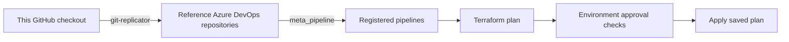

# Maintaining the reference deployment

[Français](./MAINTENANCE.fr_ca.md) | [Architecture overview](./README.md) | [Troubleshooting](./TROUBLESHOOTING.md)

This guide is for maintaining this GitHub monorepo and the reference deployment it publishes. It covers the bookkeeping needed to collect a distributed Azure DevOps system in one checkout. In normal adoption, teams work directly in their own Azure DevOps projects and repositories.

## Publishing the reference

The workflow below is for updating the reference deployment from this GitHub checkout. In an operational deployment, teams commit directly to the appropriate Azure DevOps repositories.



For this reference deployment, make changes in the outer checkout. The [Git replicator](./git-replicator/README.md) publishes the current working-tree files into the destination repositories, with one commit per changed repository. Untracked files permitted by Git's ignore rules are included. Destination files absent from the selected source are removed, so keep reference-deployment source changes here rather than in the generated clones or replicated repositories.

The [meta-pipeline][meta] discovers `.tfvars.pipeline_registration` files and creates pipeline definitions and resource authorizations. The [shared Terraform template][template] initializes, validates, and plans each Terraform root. When changes are detected, it publishes the saved plan and applies that plan through the configured environment. A plan with no changes skips apply. Approval requirements come from the environment's checks.

## Repository layout

The `AzureDevOps/Projects/<project>/Repos/<repository>/` folders represent repositories that live within separate Azure DevOps projects. Their nesting here makes the whole reference visible in one checkout; each destination repository has its own root and access controls.

`Infrastructure/` below refers to [`AzureDevOps/Projects/MyCoreProject/Repos/Infrastructure/`][infra].

| Location | Purpose |
| --- | --- |
| `git-replicator/` | Creates destination repositories and publishes their files through local Git clones. |
| `Infrastructure/Entra/` | Bootstrap application registration and service principal. |
| `Infrastructure/AzureDevOps/` | Project membership, bootstrap permissions, service connections, environments, and pipeline definitions. |
| `Infrastructure/AzureResourceManager/` | Azure resources, organized by subscription and resource group. |
| `Infrastructure/pipeline-templates/` | Shared plan-and-apply workflow and Terraform installation script. |
| `Infrastructure/modules/` | Reusable [Azure DevOps role reconciliation][security] and [persistent change tracking][rising-edge] modules. |

The agent-pool resource group has two sets of independently applied Terraform roots:

- [`core/`][core]: resource group, managed identity, Azure and Azure DevOps permissions, service connection, and workload state storage. Its pipelines use the bootstrap service connection.
- [`workload/`][workload]: Key Vault, source VM, compute gallery and image versions, VMSS, and elastic agent pool. Its Terraform pipelines use the managed identity service connection. The healthcheck directory contains a diagnostic pipeline.

Each root has its own backend state key. Running Terraform at the repository root does not deploy all of these directories.

## Reference deployment prerequisites

Use a full Git checkout, Git, PowerShell 7.2 or newer (`pwsh`), Azure CLI, and Terraform 1.8 or newer. Check each root's `terraform.tf` for provider requirements. The pipeline template runs Bash and PowerShell tooling on Linux agents.

The checked-in configuration currently refers to these existing environment values:

| Setting | Configured value |
| --- | --- |
| Azure DevOps organization / project | `https://dev.azure.com/teamdman/` / `MyCoreProject` |
| Azure subscription | `AAFC VSE Benefit` |
| Bootstrap state storage | `terraformproddwvc87`, container `statefiles`, in `CACN-Terraform-PROD-RG` |
| Workload state storage | `teamyhubazdoagentpool1sa`, created by `core/state_file_storage_account` |
| Existing virtual network | `TEAMY-NETWORK-VNET` in `TEAMY-NETWORK-RG` |
| Existing agent subnet | `Teamy-Hub-AZDO-AgentPool-1-DEV-VMSS-snet` |

Review tenant and subscription IDs, names, user and approver lists, backend keys, network lookups, and certificate configuration across Terraform, YAML, JSON, and scripts when adapting the example. The bootstrap backend, organization, and shared network must be available before roots that look them up can run. The identity running Terraform needs access to both Azure and Azure DevOps, including the relevant state containers.

For local authentication, use `az login` with the intended tenant and subscription. Azure DevOps credentials may also be needed; see [authentication troubleshooting](./TROUBLESHOOTING.md#azure-devops-provider-reports-no-valid-credentials-found). Pipeline service connections use workload identity federation. Keep credentials out of source files.

The bootstrap state account and its restricted network policy were already deployed when this architecture was developed. The shared network is currently maintained outside this repository in `teamy-azure-iac/TEAMY-NETWORK-RG`. Its current maintainer-local location is:

```text
C:\Users\phillipsdo\source\repos\teamy-azure-iac\TEAMY-NETWORK-RG
```

That location is a pointer to the existing prerequisite's ownership, not a path consumed by this repository's Terraform.

The IP allowlist is deliberately absent from public source. Workload storage copies the prerequisite account's network ACLs at deployment time. The permitted agent subnet can be public; operator IP rules remain privately configured on the bootstrap account.

## Local bootstrap and handover to the agents

Microsoft-hosted Azure DevOps agents cannot use the bootstrap state account under this reference's existing network restrictions. Use a local machine that is already allowlisted, with the required Azure and Azure DevOps permissions, until the self-hosted pool can access state.

1. Confirm that the prerequisite bootstrap account, container, shared VNet, and agent subnet exist, using the owner's documented or redacted information.
2. From the permitted local machine, create or import the [project][project] and deploy the [bootstrap Entra application][entra].
3. Configure the [bootstrap permissions and service connection][bootstrap], then create the [environments and approval checks][environments].
4. Apply the [core roots][core] locally: resource group and managed identity, then their permissions, managed identity service connection, and workload state account. The latter copies the prerequisite account's rules, allowing the permitted local deployment path to continue.
5. Apply the [workload prerequisites][workload] locally: Key Vault, compute gallery, and source VM. Verify cloud-init and connectivity.
6. Publish the gallery image, then deploy the VMSS and Azure DevOps elastic agent pool. Image preparation deprovisions and generalizes the source VM; review the [preparation script][prepare] as part of that apply.
7. Ensure that the agent subnet has a Storage service endpoint and is allowed by a virtual-network rule on the bootstrap account. Preserve that rule if it already exists; it can be established as soon as the subnet exists.
8. Reapply the workload state-storage root so it copies the updated prerequisite rules. A change to the bootstrap rules does not update workload accounts until their Terraform configuration is run.
9. Publish source with `git-replicator` and apply [`meta_pipeline`][meta] from the permitted machine once its repository, agent queue, environments, and service connections exist.
10. Run the [healthcheck][healthcheck] on the self-hosted pool and verify access to both state accounts before handing routine Terraform deployment over to pipelines. The current healthcheck lists the workload container; bootstrap-container access needs its own check.

Each root has an independent state and plan. Pipeline registration alone does not sequence these steps. Keep the permitted local deployment path available for bootstrap maintenance.

The active source image is selected by [`marketplace-image.json`][image], currently Canonical Ubuntu 24.04 LTS with `plan: null`. Terraform and the Marketplace scripts read the same file.

## Working on the reference deployment

For local maintenance of an already configured reference environment, run Terraform in the root you intend to change. For example, from this checkout's root:

```powershell
$modulePath = './AzureDevOps/Projects/MyCoreProject/Repos/Infrastructure/AzureDevOps/Projects/MyCoreProject/project'
terraform "-chdir=$modulePath" init
terraform "-chdir=$modulePath" validate
terraform "-chdir=$modulePath" plan -out=change.tfplan
terraform "-chdir=$modulePath" show -no-color change.tfplan
terraform "-chdir=$modulePath" apply change.tfplan
```

Review the plan before running the apply command. To publish source changes, return to the outer checkout and follow the [Git replicator deployment instructions](./git-replicator/README.md#prerequisites-and-deployment). Replication commits allow CI to run; an unchanged snapshot produces no commit. The clones in `git-replicator/.terraform/repos/<project>/<repository>/` are disposable caches.

When adding a Terraform pipeline:

1. Add `.tfvars.pipeline_registration` and `azure-pipelines.yml` beside the root's `terraform.tf`; use a neighboring pipeline as an example.
2. Use `yaml_path = "./azure-pipelines.yml"`. Set `pathInRepo` and trigger paths relative to the destination `Infrastructure` repository, without the outer `AzureDevOps/Projects/MyCoreProject/Repos/Infrastructure/` prefix.
3. Supply the template's service connection, environment, and agent pool parameters, with matching `endpoint`, `environment`, and `queue` authorizations in the registration.
4. Publish the files and run the meta-pipeline. Registration changes match its CI trigger. Set `enabled = false` in a registration to disable a pipeline while retaining its definition.

The shared template also accepts `destroyPlan` and `terraformTargets`; their defaults are `false` and `all`. Review the resulting plan and environment approval before applying.

## Onboarding MyFirstWorkload through pipelines

The onboarding roots live in MyCoreProject/Infrastructure and use the bootstrap connection. They follow the existing project, Entra and service-connection layouts. The connection is grouped under `AzureDevOps/Projects/MyFirstWorkload/service_connections/workload/`, with licensing, project permissions, Azure RBAC and federation in separate Terraform roots.

| Root | Responsibility | Prerequisite roots |
| --- | --- | --- |
| [project](<./AzureDevOps/Projects/MyCoreProject/Repos/Infrastructure/AzureDevOps/Projects/MyFirstWorkload/project/>) | Azure DevOps project and human memberships. | Existing Core bootstrap. |
| [MyFirstWorkload-SP](<./AzureDevOps/Projects/MyCoreProject/Repos/Infrastructure/Entra/AppRegistrations/MyFirstWorkload-SP/>) | Entra application registration, owners and service principal. | Existing Core bootstrap. |
| [devops_license](<./AzureDevOps/Projects/MyCoreProject/Repos/Infrastructure/AzureDevOps/Projects/MyFirstWorkload/service_connections/workload/devops_license/>) | Onboard the service principal into Azure DevOps. | Entra identity. |
| [devops_project_permissions](<./AzureDevOps/Projects/MyCoreProject/Repos/Infrastructure/AzureDevOps/Projects/MyFirstWorkload/service_connections/workload/devops_project_permissions/>) | Service-principal membership in Project Administrators and Endpoint Administrators. | Project and Azure DevOps licensing. |
| [service_connection](<./AzureDevOps/Projects/MyCoreProject/Repos/Infrastructure/AzureDevOps/Projects/MyFirstWorkload/service_connections/workload/service_connection/>) | Federated service connection and application federated credential. | Project and Entra identity. |
| [azure_rbac](<./AzureDevOps/Projects/MyCoreProject/Repos/Infrastructure/AzureDevOps/Projects/MyFirstWorkload/service_connections/workload/azure_rbac/>) | Contributor on the workload resource group. | Entra identity and resource group. |
| [resource_group](<./AzureDevOps/Projects/MyCoreProject/Repos/Infrastructure/AzureResourceManager/Subscriptions/AAFC VSE Benefit/Resource Groups/Teamy-Workload-MyFirstWorkload-DEV-RG/core/resource_group/>) | Teamy-Workload-MyFirstWorkload-DEV-RG. | Existing Core bootstrap. |
| [state_file_storage_account](<./AzureDevOps/Projects/MyCoreProject/Repos/Infrastructure/AzureResourceManager/Subscriptions/AAFC VSE Benefit/Resource Groups/Teamy-Workload-MyFirstWorkload-DEV-RG/core/state_file_storage_account/>) | Dedicated account, inherited network ACLs, private statefiles container and bootstrap/workload data roles. | Workload resource group and Entra identity; existing bootstrap identity, storage account and network rules. |
| [resource_provider_registrations](<./AzureDevOps/Projects/MyCoreProject/Repos/Infrastructure/AzureResourceManager/Subscriptions/AAFC VSE Benefit/resource_provider_registrations/>) | Subscription-level Microsoft.AppConfiguration registration. | Existing Core bootstrap. |

The [approval environment](./AzureDevOps/Projects/MyFirstWorkload/Repos/Infrastructure/AzureDevOps/Projects/MyFirstWorkload/environments/Main/), [workload meta-pipeline](./AzureDevOps/Projects/MyFirstWorkload/Repos/Infrastructure/AzureDevOps/Projects/MyFirstWorkload/meta_pipeline/) and [workload/app_configuration](<./AzureDevOps/Projects/MyFirstWorkload/Repos/Infrastructure/AzureResourceManager/Subscriptions/AAFC VSE Benefit/Resource Groups/Teamy-Workload-MyFirstWorkload-DEV-RG/workload/app_configuration/>) live in MyFirstWorkload/Infrastructure. They use MyFirstWorkload-ServiceConnection and separate state keys in the workload container. The workload owns its approver list and pipeline inventory.

This onboarding assumes the Core meta-pipeline and self-hosted agents already work, including agent access to bootstrap state. Publish in two stages because the workload project does not exist initially:

1. Review the source changes, then publish using the commands below. The replicator updates MyCoreProject and automatically defers MyFirstWorkload until that project exists, reporting it in `deferred_projects`. This creates no workload resources locally.
2. Let Core's meta-pipeline run on the registrations, or queue it. Approve its plan to register the nine onboarding pipelines.
3. Run the roots in the prerequisite order above. Project creation, `MyFirstWorkload-SP`, the resource group and subscription provider registration can run independently. Run licensing after the identity, then project permissions after both licensing and project creation. Run Azure RBAC and state storage after the identity and resource group exist. The storage root copies the bootstrap network rules and grants both deployment identities access to the new container. Create the service connection after the project and identity. Approve each plan and complete all these roots before workload deployment.
4. Plan and publish again. The replicator now discovers MyFirstWorkload and can create MyFirstWorkload/Infrastructure and publish its source.
5. Bootstrap the workload environment locally from `AzureDevOps/Projects/MyFirstWorkload/environments/Main`, then its meta-pipeline, following the [first-run instructions](./AzureDevOps/Projects/MyFirstWorkload/Repos/Infrastructure/AzureDevOps/Projects/MyFirstWorkload/meta_pipeline/README.md#first-run). It registers `pipeline definitions`, `MyFirstWorkload-DEV` and `Teamy-Workload-MyFirstWorkload-DEV-RG - workload - app_configuration` with their authorizations.
6. Queue `pipeline definitions` in MyFirstWorkload, then its App Configuration pipeline. Review and approve the saved plan in MyFirstWorkload-DEV. Further matching commits trigger the appropriate workload pipeline.

First publication, from the outer checkout:

```powershell
terraform -chdir=git-replicator init
terraform -chdir=git-replicator plan -out=bootstrap-publication.tfplan
terraform -chdir=git-replicator apply bootstrap-publication.tfplan
```

Second publication, after the project, identity, service connection and Azure foundations pipelines succeed:

```powershell
terraform -chdir=git-replicator plan -out=workload-publication.tfplan
terraform -chdir=git-replicator apply workload-publication.tfplan
```

The commands above operate the publisher. The workload environment and meta-pipeline also need the one-time local applies in step 5; subsequent Terraform runs use Azure DevOps. Keep every already-managed project in any explicit replicator selection. Repository deletion protection rejects a selection that drops a managed repository, and the default selection includes all discovered projects.

The workload uses `teamymyfirstworkloadsa/statefiles` in `Teamy-Workload-MyFirstWorkload-DEV-RG`. Its service principal has a blob data role on that private container, Contributor on its resource group, and Project Administrators and Endpoint Administrators membership within MyFirstWorkload. The storage root grants the bootstrap principal container data access as well. A local operator bootstrapping the workload also needs data access to the new container.

Core roots retain their state on `terraformproddwvc87/statefiles`. The service-connection and storage roots consume Entra outputs from bootstrap state. The storage root copies the prerequisite account's network ACLs at deployment time, excluding `ipv6Rules`, as the agent-pool storage root does. Keep resolved rules and plan artifacts private. After prerequisite network rules change, run the storage pipeline again to update the copy. The workload environment, meta-pipeline and App Configuration roots use the new account and do not read Core state or bootstrap account properties.

The existing elastic pool's `auto_provision = true` supplies a queue in the new project. If the pipeline-registration lookup fails, confirm that queue provisioning has completed before retrying. Azure role propagation may similarly require retrying the initial workload run.

The first workload run is not triggered while its definition is being created, so authorization can finish first. Its repository includes a copy of the Terraform template and installer; review updates to both projects' copies when maintaining this reference. Each project's meta-pipeline discovers only the registrations in its own Infrastructure repository. Add future workload pipeline registrations to the workload repository.

## Bringing the prerequisites into this repository

This is proposed follow-up work, not implemented onboarding. Moving the shared network and bootstrap storage definitions here would make the reference more self-contained while preserving private ownership of the IP allowlist.

The owner's redacted account example identifies `terraformproddwvc87` in `CACN-Terraform-PROD-RG`, in Canada Central, with `StorageV2` / `Standard_LRS`, public network access enabled, and a default-deny network policy. It also identifies this existing `virtualNetworkRules` entry, which can be included in public documentation or configuration:

```json
{
  "id": "/subscriptions/6cb7032f-2437-4f5e-91e8-676cb67e5444/resourceGroups/TEAMY-NETWORK-RG/providers/Microsoft.Network/virtualNetworks/TEAMY-NETWORK-VNET/subnets/Teamy-Hub-AZDO-AgentPool-1-DEV-VMSS-snet",
  "action": "Allow"
}
```

The onboarding should address these points:

- Transfer Terraform ownership of the existing network resources from `teamy-azure-iac` deliberately, preserving resource IDs and avoiding two roots managing the same resources. Adopt the existing bootstrap account without recreating it.
- Keep the approved subnet rule in public configuration and the operator IP allowlist under private management. Scope `ignore_changes` to the privately managed fields so the intended subnet rule can still be managed. Validate the chosen provider's behavior before applying an ownership change.
- Define where the bootstrap account's own Terraform state lives. A new account cannot serve as its backend before it exists; initial state and any later migration need an explicit procedure.
- For a new deployment, establish the private operator access needed for local bootstrap. Ignoring later rule changes does not provision that initial access.
- Continue copying the prerequisite ACLs into workload accounts, without checking the resolved IP values into source.

Terraform's [`ignore_changes`](https://developer.hashicorp.com/terraform/language/meta-arguments/lifecycle#ignore_changes) controls update planning; it does not redact provider reads or remove values from state. [State and plan files can contain sensitive values](https://developer.hashicorp.com/terraform/language/manage-sensitive-data). Keep those artifacts and any logs that expose resolved ACLs private.

For documentation and assisted maintenance, use owner-supplied redacted examples. Do not retrieve full storage-account properties or open state files to inspect IP allowlists. Record only the resource identities, permitted subnet, and access results needed for the task.

## Git replication fails or unexpected files are published

This section applies to maintaining the reference deployment through `git-replicator`. In an operational deployment of the architecture, teams normally commit directly to their Azure DevOps repositories.

The replicator copies selected working-tree files, including untracked files permitted by Git's ignore rules. Inspect source selection before publishing:

```powershell
git status --short
git ls-files --cached --others --exclude-standard -- AzureDevOps/Projects/MyCoreProject/Repos/Infrastructure
```

For the replicated reference deployment, the outer checkout is the source of truth. Changes in destination repositories or in `git-replicator/.terraform/repos/` are reconciled to that source. Remote-only files are removed by the next synchronization.

For a rejected push, inspect the remote change, reconcile any work to keep into the source checkout, then create a fresh Terraform plan and apply it. The replicator retries from the current remote head without a force push. An unchanged snapshot creates no commit and no push-triggered CI run.

When migrating from the old per-file implementation, the checked-in `removed` block forgets `azuredevops_git_repository_file.main` instances with `destroy = false`. Manual state removal is not required. See the [replicator migration guide](./git-replicator/README.md#migration-from-per-file-resources).

## Windows paths or directory operations fail

This repository contains deeply nested paths. A short checkout location such as `C:\src\ra` reduces path-length problems in Git, shells, editors, and other tools. If PowerShell becomes less responsive or falls back to a plain `PS>` prompt, check the path length alongside prompt and profile errors.

From an existing checkout, enable Git for Windows long-path support for this repository:

```powershell
git config --local core.longpaths true
```

This setting applies to Git; other tools can have their own limits. See the [Git for Windows guidance](https://gitforwindows.org/git-cannot-create-a-file-or-directory-with-a-long-path.html).

If Git cannot remove a directory during checkout or rebase, close terminals, file explorers, or other processes holding that directory open, then inspect `git status` before retrying. Path length and open handles are possible causes; the message alone does not identify which one applies.

## Further reading

- [Architecture overview](./README.md): ownership, state access, agent bootstrapping, and the deployment model.
- [Operational troubleshooting](./TROUBLESHOOTING.md): authentication, pipeline validation, state access, Marketplace images, and VM checks.
- [Git replicator guide](./git-replicator/README.md): discovery, authentication, migration, and local checks.
- [Meta-pipeline guide][meta]: registration and environment prerequisites.

[infra]: ./AzureDevOps/Projects/MyCoreProject/Repos/Infrastructure/
[entra]: ./AzureDevOps/Projects/MyCoreProject/Repos/Infrastructure/Entra/AppRegistrations/MyCoreProject-Bootstrap-SP/
[project]: ./AzureDevOps/Projects/MyCoreProject/Repos/Infrastructure/AzureDevOps/Projects/MyCoreProject/project/
[bootstrap]: ./AzureDevOps/Projects/MyCoreProject/Repos/Infrastructure/AzureDevOps/Projects/MyCoreProject/service_connections/bootstrap/
[environments]: ./AzureDevOps/Projects/MyCoreProject/Repos/Infrastructure/AzureDevOps/Projects/MyCoreProject/environments/
[meta]: ./AzureDevOps/Projects/MyCoreProject/Repos/Infrastructure/AzureDevOps/Projects/MyCoreProject/meta_pipeline/README.md
[template]: ./AzureDevOps/Projects/MyCoreProject/Repos/Infrastructure/pipeline-templates/terraform-plan-and-apply/azure-pipelines.yml
[core]: <./AzureDevOps/Projects/MyCoreProject/Repos/Infrastructure/AzureResourceManager/Subscriptions/AAFC VSE Benefit/Resource Groups/Teamy-Hub-AZDO-AgentPool-1-DEV-VMSS-RG/core/>
[workload]: <./AzureDevOps/Projects/MyCoreProject/Repos/Infrastructure/AzureResourceManager/Subscriptions/AAFC VSE Benefit/Resource Groups/Teamy-Hub-AZDO-AgentPool-1-DEV-VMSS-RG/workload/>
[image]: <./AzureDevOps/Projects/MyCoreProject/Repos/Infrastructure/AzureResourceManager/Subscriptions/AAFC VSE Benefit/Resource Groups/Teamy-Hub-AZDO-AgentPool-1-DEV-VMSS-RG/workload/vm_image/marketplace-image.json>
[prepare]: <./AzureDevOps/Projects/MyCoreProject/Repos/Infrastructure/AzureResourceManager/Subscriptions/AAFC VSE Benefit/Resource Groups/Teamy-Hub-AZDO-AgentPool-1-DEV-VMSS-RG/workload/compute_gallery_image_versions/prepare.ps1>
[healthcheck]: <./AzureDevOps/Projects/MyCoreProject/Repos/Infrastructure/AzureResourceManager/Subscriptions/AAFC VSE Benefit/Resource Groups/Teamy-Hub-AZDO-AgentPool-1-DEV-VMSS-RG/workload/pipeline_healthcheck/azure-pipelines.yml>
[security]: ./AzureDevOps/Projects/MyCoreProject/Repos/Infrastructure/modules/devops_security/README.md
[rising-edge]: ./AzureDevOps/Projects/MyCoreProject/Repos/Infrastructure/modules/rising_edge/README.md
