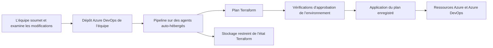

    <h1>Architecture de référence Azure DevOps</h1>
    

[English](./README.md) | [Dépannage](./TROUBLESHOOTING.fr_ca.md) | [Maintenance de cette référence](./MAINTENANCE.fr_ca.md)

Cette architecture montre comment répartir le contrôle des charges de travail Azure entre des projets et des dépôts Azure DevOps. Les équipes gèrent leurs sources, examinent les modifications et déploient au moyen de pipelines dont les identités, les autorisations et l’accès à l’état Terraform sont explicites.

L’exemple fonctionnel construit un pool d’agents Ubuntu utilisant un groupe de machines virtuelles identiques (VMSS) et l’infrastructure nécessaire : identités, stockage d’état, machine virtuelle source, Azure Compute Gallery, connexions de service et pipelines de déploiement.

Ce dépôt GitHub rassemble ce système distribué en un seul endroit pour en expliquer les relations. En utilisation normale, les équipes soumettent leurs modifications directement dans leurs dépôts Azure DevOps. L’adoption de l’architecture n’exige ni une copie dérivée GitHub ni le réplicateur Git utilisé pour maintenir ce déploiement de référence.

## Les responsabilités suivent les projets et les dépôts

Les projets et les dépôts Azure DevOps définissent où les équipes travaillent et où le contrôle est délégué. Les autorisations des dépôts déterminent qui peut modifier le code de déploiement; les autorisations de pipelines et les connexions de service déterminent les ressources accessibles à un pipeline.

L’exemple sépare la mise en place des fondations de la livraison des charges de travail :

| Domaine | Responsabilité dans l’exemple |
| --- | --- |
| Amorçage | Établir le projet, l’identité initiale, les connexions de service et les autorisations nécessaires à la délégation du déploiement. |
| Core | Gérer le groupe de ressources du pool d’agents, l’identité managée, ses autorisations Azure et Azure DevOps et le stockage d’état des charges de travail. |
| Workload | Construire l’image de machine virtuelle, publier les images de galerie, gérer le VMSS et le pool d’agents élastique et vérifier leur fonctionnement. |

Les pipelines Core utilisent la connexion de service d’amorçage. Les pipelines Terraform des charges de travail utilisent une connexion de service distincte associée à une identité managée et à ses autorisations. L’identité et les pouvoirs derrière chaque déploiement sont ainsi explicites.

Chaque module racine Terraform possède sa propre clé d’état distant et son propre cycle de déploiement. Les dépendances entre modules racines doivent être en place avant l’exécution de leurs consommateurs; des inscriptions de pipelines distinctes n’imposent pas automatiquement un ordre d’exécution.

## Les modifications suivent un déploiement examiné

Le [modèle de pipeline partagé][template] initialise et valide Terraform, puis produit un plan enregistré. Lorsque le plan contient des modifications, l’étape Apply utilise ce même plan après les vérifications de l’environnement. Un plan sans modification saute l’étape Apply.

Les définitions de pipelines et les autorisations d’accès aux ressources sont elles-mêmes gérées par le [méta-pipeline][meta]. Une inscription identifie le fichier YAML du pipeline ainsi que la file d’agents, la connexion de service et l’environnement qu’il peut utiliser. Le pipeline obtenu fonctionne dans les limites de ces autorisations.

## L’accès à l’état combine identité et accès réseau

Terraform a besoin à la fois d’une autorisation d’accès à son état et d’un chemin réseau vers le conteneur d’état. L’exemple utilise un compte de stockage d’amorçage préalable pour l’état des fondations et crée un compte distinct pour l’état des charges de travail.

La référence a été développée alors que le compte de stockage d’amorçage, ses restrictions réseau et le réseau virtuel partagé étaient déjà déployés. Le compte de stockage des charges de travail copie les règles réseau de ce compte préalable pendant l’exécution de Terraform. Cette approche conserve les adresses IP sensibles hors des sources publiques tout en réutilisant la politique d’accès établie.

L’autorisation de réseau virtuel du sous-réseau des agents peut être décrite dans la configuration publique. Les listes d’adresses IP autorisées des opérateurs demeurent gérées de façon privée sur le compte préalable. La copie des règles ne les exclut pas des données utilisées par Terraform à l’exécution; les artefacts d’état et de plan doivent demeurer privés.

Il s’agit d’une copie au moment du déploiement, et non d’un lien de politique dynamique entre les comptes de stockage. Lorsque les règles préalables changent, une autre exécution de Terraform doit les récupérer et les appliquer au stockage des charges de travail.

## Amorcer depuis un réseau qui possède déjà l’accès

Les restrictions réseau du compte préalable rendent les agents Azure DevOps hébergés par Microsoft impraticables pour amorcer cette référence telle qu’elle est configurée. Le déploiement initial s’effectue donc localement depuis une machine déjà autorisée à accéder à l’état d’amorçage.

1. Commencez avec le compte d’état d’amorçage et le réseau partagé existants. Établissez le projet Azure DevOps, l’identité d’amorçage, les autorisations et les connexions de service depuis la machine locale autorisée.
2. Déployez localement les ressources Core et les prérequis des charges de travail, puis la machine virtuelle source, l’image de galerie, le VMSS et le pool d’agents Azure DevOps.
3. Autorisez le sous-réseau du pool d’agents sur le compte de stockage d’amorçage et configurez son point de terminaison de service Storage. La règle peut être établie dès que le sous-réseau existe; conservez-la si elle est déjà configurée.
4. Réappliquez la configuration du stockage des charges de travail pour copier les règles préalables mises à jour. Confirmez l’accès à l’état depuis les agents auto-hébergés, puis utilisez ce pool pour les déploiements courants par pipeline.

La règle de sous-réseau fournit l’accès réseau; l’identité du pipeline doit toujours posséder les autorisations appropriées sur les données blob. Azure explique la relation entre le point de terminaison et la règle de sous-réseau dans la documentation sur l’[accès réseau à Storage](https://learn.microsoft.com/en-us/azure/storage/common/storage-network-security).

Le compte de stockage d’amorçage et le réseau partagé sont actuellement des prérequis externes. Leur intégration à ce dépôt pourrait rendre l’exemple plus autonome. Le [guide de maintenance](./MAINTENANCE.fr_ca.md#intégrer-les-prérequis-à-ce-dépôt) décrit ce travail et la façon de conserver une gestion distincte des règles IP privées.

## Construire les agents qui exécutent les charges de travail

L’exemple prépare une machine virtuelle Ubuntu source avec cloud-init, publie une image dans Azure Compute Gallery et utilise cette image pour le VMSS qui soutient un pool élastique Azure DevOps.

La définition de l’image active est centralisée dans [`marketplace-image.json`][image], qui utilise actuellement Canonical Ubuntu 24.04 LTS sans plan d’achat. Terraform et les scripts Marketplace consomment cette définition. La publication d’image exécute [le script de préparation][prepare], qui déprovisionne et généralise la machine source; il s’agit d’une machine jetable servant à créer les images.

Le [pipeline de vérification de l’état][healthcheck] exerce les outils, Docker, la connectivité, l’authentification Azure et l’accès au conteneur d’état des charges de travail sur les agents obtenus. Sa requête anonyme vers Azure DevOps vérifie l’accessibilité; les opérations authentifiées vérifient séparément les autorisations de l’appelant.

## Explorer l’implémentation

Les dossiers sous `AzureDevOps/Projects/<project>/Repos/<repository>/` représentent les dépôts Azure DevOps individuels rassemblés ici. Dans le dépôt [`Infrastructure` de l’exemple][infra] :

| Code | Éléments à examiner |
| --- | --- |
| [Projet][project], [identité d’amorçage][entra] et [connexions de service][bootstrap] | Mise en place des pouvoirs de déploiement. |
| [Modules racines Core][core] | Identité managée, autorisations déléguées et stockage d’état des charges de travail. |
| [Modules racines Workload][workload] | Création d’image, galerie, VMSS, pool d’agents et vérification de l’état. |
| [Environnements][environments] et [modèle de pipeline][template] | Vérifications d’approbation et application du plan examiné. |
| [Méta-pipeline][meta] | Inscription et autorisation des pipelines sous forme de code. |
| [Rôles de sécurité][security] et [rising edge][rising-edge] | Réconciliation des autorisations et suivi persistant des changements. |

Pour adopter l’architecture, placez le code Terraform et les pipelines pertinents dans des projets et des dépôts Azure DevOps qui correspondent aux responsabilités de vos équipes. Adaptez les identités, les emplacements d’état distant, les prérequis réseau et les exigences d’approbation à cet environnement.

Pour travailler sur cette copie GitHub particulière, consultez [MAINTENANCE.fr_ca.md](./MAINTENANCE.fr_ca.md). Ce guide traite de la réplication des sources, des noms concrets du déploiement, des commandes locales, de l’inscription des pipelines et du travail restant pour intégrer les prérequis. Les échecs opérationnels sont abordés dans [TROUBLESHOOTING.fr_ca.md](./TROUBLESHOOTING.fr_ca.md).

## Licence et droits d’auteur

Consultez [LICENSE.fr_ca.txt](./LICENSE.fr_ca.txt) pour la Licence Libre du Québec – Réciprocité (LiLiQ-R).

Droits d’auteur appartiennent à © Sa Majesté le Roi du chef du Canada, qui est représenté par le ministre de l’Agriculture et de l’Agroalimentaire, 2025.

[infra]: ./AzureDevOps/Projects/MyCoreProject/Repos/Infrastructure/
[entra]: ./AzureDevOps/Projects/MyCoreProject/Repos/Infrastructure/Entra/AppRegistrations/MyCoreProject-Bootstrap-SP/
[project]: ./AzureDevOps/Projects/MyCoreProject/Repos/Infrastructure/AzureDevOps/Projects/MyCoreProject/project/
[bootstrap]: ./AzureDevOps/Projects/MyCoreProject/Repos/Infrastructure/AzureDevOps/Projects/MyCoreProject/service_connections/bootstrap/
[environments]: ./AzureDevOps/Projects/MyCoreProject/Repos/Infrastructure/AzureDevOps/Projects/MyCoreProject/environments/
[meta]: ./AzureDevOps/Projects/MyCoreProject/Repos/Infrastructure/AzureDevOps/Projects/MyCoreProject/meta_pipeline/README.md
[template]: ./AzureDevOps/Projects/MyCoreProject/Repos/Infrastructure/pipeline-templates/terraform-plan-and-apply/azure-pipelines.yml
[core]: <./AzureDevOps/Projects/MyCoreProject/Repos/Infrastructure/AzureResourceManager/Subscriptions/AAFC VSE Benefit/Resource Groups/Teamy-Hub-AZDO-AgentPool-1-DEV-VMSS-RG/core/>
[workload]: <./AzureDevOps/Projects/MyCoreProject/Repos/Infrastructure/AzureResourceManager/Subscriptions/AAFC VSE Benefit/Resource Groups/Teamy-Hub-AZDO-AgentPool-1-DEV-VMSS-RG/workload/>
[image]: <./AzureDevOps/Projects/MyCoreProject/Repos/Infrastructure/AzureResourceManager/Subscriptions/AAFC VSE Benefit/Resource Groups/Teamy-Hub-AZDO-AgentPool-1-DEV-VMSS-RG/workload/vm_image/marketplace-image.json>
[prepare]: <./AzureDevOps/Projects/MyCoreProject/Repos/Infrastructure/AzureResourceManager/Subscriptions/AAFC VSE Benefit/Resource Groups/Teamy-Hub-AZDO-AgentPool-1-DEV-VMSS-RG/workload/compute_gallery_image_versions/prepare.ps1>
[healthcheck]: <./AzureDevOps/Projects/MyCoreProject/Repos/Infrastructure/AzureResourceManager/Subscriptions/AAFC VSE Benefit/Resource Groups/Teamy-Hub-AZDO-AgentPool-1-DEV-VMSS-RG/workload/pipeline_healthcheck/azure-pipelines.yml>
[security]: ./AzureDevOps/Projects/MyCoreProject/Repos/Infrastructure/modules/devops_security/README.md
[rising-edge]: ./AzureDevOps/Projects/MyCoreProject/Repos/Infrastructure/modules/rising_edge/README.md
