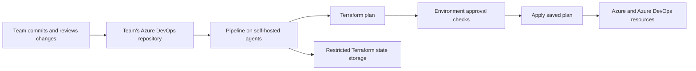

    <h1>Azure DevOps Reference Architecture</h1>
    

[Français](./README.fr_ca.md) | [Troubleshooting](./TROUBLESHOOTING.md) | [Maintaining this reference](./MAINTENANCE.md)

This architecture shows how to distribute control of Azure workloads across Azure DevOps projects and repositories. Teams own their source, review changes, and deploy through pipelines with explicit identities, permissions, and access to Terraform state.

The working example builds an Ubuntu Virtual Machine Scale Set (VMSS) agent pool and the infrastructure it needs: identities, state storage, a source VM, Azure Compute Gallery, service connections, and deployment pipelines.

This GitHub repository collects that distributed system in one location so its relationships can be understood together. In normal use, teams commit directly to their Azure DevOps repositories. Adopting the architecture does not require a GitHub fork or the Git replicator used to maintain this reference deployment.

## Ownership follows projects and repositories

Azure DevOps projects and repositories define where teams work and where control is delegated. Repository permissions govern who can change the deployment code; pipeline authorizations and service connections govern which resources a pipeline can use.

The example separates foundational setup from workload delivery:

| Area | Responsibility in the example |
| --- | --- |
| Bootstrap | Establish the project, initial identity, service connections, and permissions needed to delegate deployment. |
| Core | Manage the agent-pool resource group, managed identity, its Azure and Azure DevOps permissions, and workload state storage. |
| Workload | Build the VM image, publish gallery images, manage the VMSS and elastic agent pool, and check their operation. |

Core pipelines use the bootstrap service connection. Workload Terraform pipelines use a separate managed identity service connection with assigned permissions. This makes the identity and authority behind each deployment explicit.

Each Terraform root has its own backend state key and deployment lifecycle. Dependencies between roots must be established before their consumers run; separate pipeline registrations do not automatically impose an execution order.

## Changes follow a reviewed deployment path

The [shared pipeline template][template] initializes and validates Terraform, then produces a saved plan. When the plan contains changes, the Apply stage uses that same plan after the environment's checks. A plan without changes skips Apply.

Pipeline definitions and resource authorizations are themselves managed by the [meta-pipeline][meta]. A registration identifies the pipeline YAML and the queue, service connection, and environment it may use. The resulting pipeline operates within those permissions.

## State access combines identity and network access

Terraform needs both permission to access its state and a network path to the state container. The example uses a prerequisite bootstrap storage account for foundational state and creates a separate storage account for workload state.

The reference was developed with the bootstrap storage account, its network restrictions, and the shared virtual network already deployed. The workload storage account copies network rules from that prerequisite account during Terraform execution. This keeps sensitive IP allowlist values out of the public source while reusing the established access policy.

The agent subnet's virtual-network permission can be described in public configuration. Operator IP allowlists remain privately maintained on the prerequisite account. Copying the rules does not make them absent from Terraform's runtime data; state and plan artifacts must remain private.

This is a copy at deployment time, not a live policy link between storage accounts. When the prerequisite rules change, the workload storage configuration needs another Terraform run to pick up and apply them.

## Bootstrap from a network that already has access

The prerequisite account's network restrictions make Microsoft-hosted Azure DevOps agents infeasible for bootstrapping this reference as configured. The initial deployment therefore runs locally from a machine that is already permitted to access the bootstrap state.

1. Start with the existing bootstrap state account and shared network. Establish the Azure DevOps project, bootstrap identity, permissions, and service connections from the permitted local machine.
2. Locally deploy the core resources and workload prerequisites, then the source VM, gallery image, VMSS, and Azure DevOps agent pool.
3. Permit the agent-pool subnet on the bootstrap storage account and configure the subnet's Storage service endpoint. A subnet rule can be established as soon as the subnet exists; preserve it if already configured.
4. Reapply the workload storage configuration to copy the prerequisite account's updated rules. Confirm state access from the self-hosted agents, then use that pool for routine pipeline deployments.

The subnet rule supplies network access; the pipeline identity still needs the appropriate blob data permissions. Azure documents the endpoint and subnet-rule relationship in [Storage network access](https://learn.microsoft.com/en-us/azure/storage/common/storage-network-security).

The bootstrap storage account and shared network are currently external prerequisites. Bringing them into this repository is a possible next step toward a more self-contained example. The [maintenance guide](./MAINTENANCE.md#bringing-the-prerequisites-into-this-repository) records that work and how private IP rules would remain separately managed.

## Build the agents that run the workloads

The example prepares a source Ubuntu VM with cloud-init, publishes an image to Azure Compute Gallery, and uses that image for the VMSS behind an Azure DevOps elastic pool.

The active image definition is centralized in [`marketplace-image.json`][image], currently Canonical Ubuntu 24.04 LTS with no purchase plan. Terraform and the Marketplace helper scripts consume that definition. Image publication runs [the preparation script][prepare], which deprovisions and generalizes the source VM; it is a disposable image-build machine.

The [healthcheck pipeline][healthcheck] exercises tools, Docker, connectivity, Azure authentication, and workload state-container access on the resulting agents. Its anonymous Azure DevOps connectivity probe checks reachability; authenticated operations check the caller's permissions separately.

## Explore the implementation

The folders under `AzureDevOps/Projects/<project>/Repos/<repository>/` represent the individual Azure DevOps repositories collected here. Within the example [`Infrastructure` repository][infra]:

| Code | What to look for |
| --- | --- |
| [Project][project], [bootstrap identity][entra], and [service connections][bootstrap] | How deployment authority is established. |
| [Core roots][core] | Managed identity, delegated permissions, and workload state storage. |
| [Workload roots][workload] | Image creation, gallery, VMSS, agent pool, and healthcheck. |
| [Environments][environments] and [pipeline template][template] | Approval checks and applying the reviewed plan. |
| [Meta-pipeline][meta] | Pipeline registration and authorization as code. |
| [Security roles][security] and [rising edge][rising-edge] | Reconciliation of permissions and persistent change tracking. |

For adoption, place the relevant Terraform and pipeline code in Azure DevOps projects and repositories that match your teams' responsibilities. Adapt identities, backend locations, network prerequisites, and approval requirements to that environment.

For work on this particular GitHub checkout, use [MAINTENANCE.md](./MAINTENANCE.md). It covers source replication, concrete deployment names, local commands, pipeline registration, and the remaining prerequisite onboarding work. Operational failures are covered in [TROUBLESHOOTING.md](./TROUBLESHOOTING.md).

## Licence and copyright

See [LICENSE.txt](./LICENSE.txt) for the Québec Free and Open-Source Licence – Reciprocity (LiLiQ-R).

Copyright belongs to © His Majesty the King in Right of Canada, as represented by the Minister of Agriculture and Agri-Food, 2025.

[infra]: ./AzureDevOps/Projects/MyCoreProject/Repos/Infrastructure/
[entra]: ./AzureDevOps/Projects/MyCoreProject/Repos/Infrastructure/Entra/AppRegistrations/MyCoreProject-Bootstrap-SP/
[project]: ./AzureDevOps/Projects/MyCoreProject/Repos/Infrastructure/AzureDevOps/Projects/MyCoreProject/project/
[bootstrap]: ./AzureDevOps/Projects/MyCoreProject/Repos/Infrastructure/AzureDevOps/Projects/MyCoreProject/service_connections/bootstrap/
[environments]: ./AzureDevOps/Projects/MyCoreProject/Repos/Infrastructure/AzureDevOps/Projects/MyCoreProject/environments/
[meta]: ./AzureDevOps/Projects/MyCoreProject/Repos/Infrastructure/AzureDevOps/Projects/MyCoreProject/meta_pipeline/README.md
[template]: ./AzureDevOps/Projects/MyCoreProject/Repos/Infrastructure/pipeline-templates/terraform-plan-and-apply/azure-pipelines.yml
[core]: <./AzureDevOps/Projects/MyCoreProject/Repos/Infrastructure/AzureResourceManager/Subscriptions/AAFC VSE Benefit/Resource Groups/Teamy-Hub-AZDO-AgentPool-1-DEV-VMSS-RG/core/>
[workload]: <./AzureDevOps/Projects/MyCoreProject/Repos/Infrastructure/AzureResourceManager/Subscriptions/AAFC VSE Benefit/Resource Groups/Teamy-Hub-AZDO-AgentPool-1-DEV-VMSS-RG/workload/>
[image]: <./AzureDevOps/Projects/MyCoreProject/Repos/Infrastructure/AzureResourceManager/Subscriptions/AAFC VSE Benefit/Resource Groups/Teamy-Hub-AZDO-AgentPool-1-DEV-VMSS-RG/workload/vm_image/marketplace-image.json>
[prepare]: <./AzureDevOps/Projects/MyCoreProject/Repos/Infrastructure/AzureResourceManager/Subscriptions/AAFC VSE Benefit/Resource Groups/Teamy-Hub-AZDO-AgentPool-1-DEV-VMSS-RG/workload/compute_gallery_image_versions/prepare.ps1>
[healthcheck]: <./AzureDevOps/Projects/MyCoreProject/Repos/Infrastructure/AzureResourceManager/Subscriptions/AAFC VSE Benefit/Resource Groups/Teamy-Hub-AZDO-AgentPool-1-DEV-VMSS-RG/workload/pipeline_healthcheck/azure-pipelines.yml>
[security]: ./AzureDevOps/Projects/MyCoreProject/Repos/Infrastructure/modules/devops_security/README.md
[rising-edge]: ./AzureDevOps/Projects/MyCoreProject/Repos/Infrastructure/modules/rising_edge/README.md
